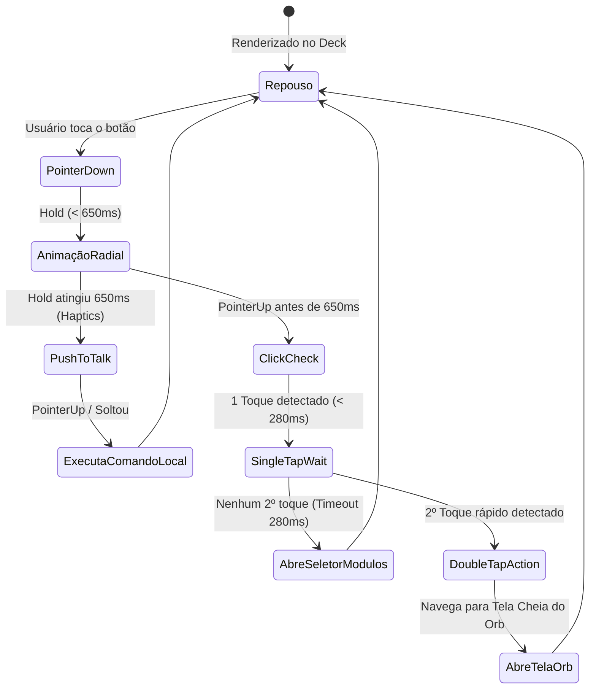

# 🗺️ MAPAS E FLUXOS DA PLATAFORMA LUCI

Este documento é a **Fonte Única de Verdade (Single Source of Truth)** para a arquitetura de navegação, fluxos de interação tátil/voz e trânsito de dados entre os módulos do Super App e o Core Backend da Luci.

---

## 1. ARQUITETURA GLOBAL DE NAVEGAÇÃO

O sistema utiliza uma abordagem **Modular e Desacoplada** baseada no padrão *Layered Architecture*:

```
┌───────────────────────────────────────────────────────────────────────────┐
│                           CAMADA DE TELAS                                 │
│  Renderiza o módulo ativo sem acoplamento de estado ou de rede direta.    │
├───────────────────────────────────────────────────────────────────────────┤
│                     MINI-PLAYER / CONTEXT OVERLAYS                        │
│  Ex: Push-to-Talk Overlay, Mini-Player de Áudio (posicionados sobre o deck)│
├───────────────────────────────────────────────────────────────────────────┤
│                        DECK MODULAR CONTEXTUAL                            │
│  Slots simétricos (1 ou 2 ícones de cada lado) + Botão Central Ubíquo.   │
├───────────────────────────────────────────────────────────────────────────┤
│                     STORE GLOBAL (Zustand Atômico)                        │
│  useAppNavigationStore | useAudioPlayerStore | useVoiceStore             │
└───────────────────────────────────────────────────────────────────────────┘
```

---

## 2. O BOTÃO CENTRAL UBÍQUO & METÁFORA TÁTIL

O Botão Central (`LuciCentralButton`) é o elemento constante em todo o aplicativo. Ele representa a identidade de marca e o acesso onipresente à inteligência da Luci.

### Matriz de Gestos Físicos e Ações:



| Gesto | Threshold / Tempo | Ação Disparada | Comportamento na UI |
| :--- | :--- | :--- | :--- |
| **1 Tap Rápido** | `< 300ms` | Abre `ModuleSelectorModal` | Exibe a grelha de módulos expansíveis com fundo desfoque. |
| **2 Taps Rápidos** | `< 400ms` intervalo | Navega para Módulo Orb | Alterna imediatamente para a tela cheia do Orb conversacional. |
| **Hold (Pressionar)**| `650ms - 800ms` | Ativa `Push-to-Talk` | Preenche o anel radial SVG gradualmente; ao soltar, processa comando no local. |

---

## 3. MAPA DE MÓDULOS E ABAS SIMÉTRICAS

O deck ajusta simetricamente os ícones dependendo do módulo ativo (**sempre números pares**):

```
                       [ + ] (Botão Central)
             ┌───────────┴───────────┐
      Lado Esquerdo              Lado Direito
    [ Ícone 1 ] [ Ícone 2 ]    [ Ícone 3 ] [ Ícone 4 ]
```

### Registro Oficial de Módulos (`MODULES_REGISTRY`):

1. **Luci Assistant (`orb`)** — *(2 telas)*
   - **Esquerda:** `Anexar` (Docs / Imagens)
   - **Direita:** `Chat` (Histórico & Mensagens)
   - **Aba Padrão:** `chat`

2. **LuciMusic (`music`)** — *(4 telas)*
   - **Esquerda:** `Início` \| `Buscar`
   - **Direita:** `Biblioteca` \| `Perfil`
   - **Aba Padrão:** `home`

3. **Cinema & Séries (`cinema`)** — *(4 telas)*
   - **Esquerda:** `Início` \| `Buscar`
   - **Direita:** `Favoritos` \| `Perfil`
   - **Aba Padrão:** `home`

4. **Casa Inteligente / IoT (`home`)** — *(4 telas)*
   - **Esquerda:** `Início` \| `Ambientes`
   - **Direita:** `Dispositivos` \| `Cenas`
   - **Aba Padrão:** `home`

5. **Treino & Saúde (`fitness`)** — *(4 telas)*
   - **Esquerda:** `Rotinas` \| `Exercícios`
   - **Direita:** `Estatísticas` \| `Perfil`
   - **Aba Padrão:** `routines`

6. **Finanças Pessoais (`finance`)** — *(4 telas)*
   - **Esquerda:** `Visão Geral` \| `Extrato`
   - **Direita:** `Metas` \| `Cartões`
   - **Aba Padrão:** `overview`

7. **Agenda & Tarefas (`tasks`)** — *(4 telas)*
   - **Esquerda:** `Agenda` \| `Tarefas`
   - **Direita:** `Hábitos` \| `Notas`
   - **Aba Padrão:** `calendar`

---

## 4. FLUXO DE DADOS & COMUNICAÇÃO DE REDE

1. **Camada de Cliente de API (`lib/api.ts`):**
   - No celular (Capacitor/Android): direciona automaticamente para o servidor Termux `http://192.168.15.90:8000`.
   - Na web/desenvolvimento: utiliza detecção de host com fallback resiliente.
   - Timeout padrão de 8 segundos com cancelamento via `AbortController`.
   - **Fallback Local Imediato:** Telas nunca ficam brancas; carregam o estado local padrão e sincronizam em segundo plano.

---

## 5. REGRAS DE EVOLUÇÃO
- Toda adição de novo módulo deve ser registrada neste documento e declarada em `stores/useAppNavigationStore.ts`.
- As abas do deck de cada módulo devem respeitar a simetria par (1+1 ou 2+2).
